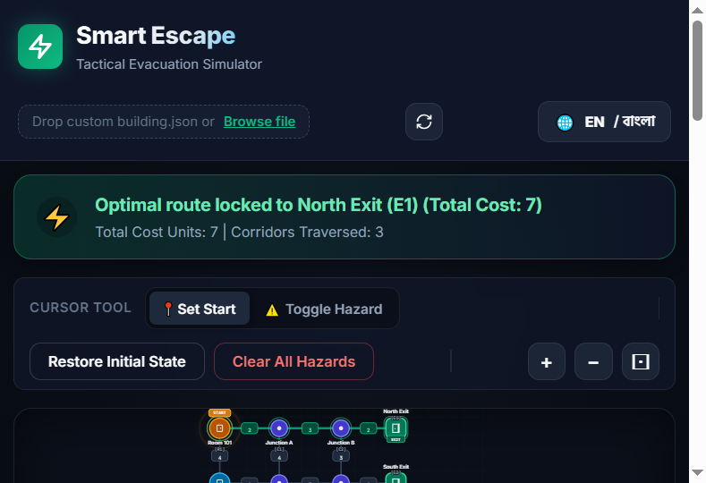

# Smart Escape

<div align="center">


</div>

<div align="center">


</div>

Smart Escape is a browser-based evacuation route simulator built with HTML, CSS, and JavaScript. It visualizes a building layout, lets users set an evacuation start point, and dynamically recalculates the safest route using Dijkstra's algorithm when hazards, blocked nodes, closed exits, or blocked corridors are introduced.

## Screenshots

<p align="center">
  
</p>

<div align="center">
  
  
</div>

## Features

- Interactive building map with room, junction, and exit nodes
- Start-point selection by clicking a node
- Real-time route calculation using Dijkstra's shortest-path algorithm
- Hazard toggling for:
  - blocked nodes
  - blocked corridors (edges)
  - closed exits
- Dynamic rerouting when the environment changes
- Bilingual interface support for English and Bengali
- Drag-and-drop or file upload support for custom building JSON datasets
- Zoom and pan controls for map navigation
- Status banner, route summary, and hazard management sidebar

## Project Structure

- `index.html` – application layout and UI markup
- `styles.css` – visual styling and responsive layout
- `app.js` – simulation logic, pathfinding, UI updates, and event handling
- `i18n.js` – language translations and text management
- `building.json` – default building dataset used by the simulator

## Run the App

This project is a static web app and can be hosted on GitHub Pages.

### GitHub Pages

After pushing the project to GitHub, enable GitHub Pages in the repository settings and use the published site URL:

```text
https://mehrab-hossen.github.io/Smart_Escape_Practice/
```

### Local development

If you want to run it locally before publishing, use a simple static server:

```bash
python -m http.server 8000
```

Then open:

```text
http://localhost:8000/
```

### VS Code Live Server

Open the project in VS Code and run it with a local static server extension such as Live Server.

## Using the Simulator

1. Open the app in the browser.
2. Click a room or junction to set the evacuation start point.
3. The app calculates the best route to an open exit.
4. Toggle hazards on nodes, edges, or exits to test rerouting.
5. Use the zoom controls and map controls to inspect the building layout.
6. Load a custom building JSON file if needed.

## How the Pathfinding Works

The simulator models the building as a weighted graph:

- each room, junction, and exit is a node
- each corridor or connection is an edge
- each edge has a cost value, representing travel difficulty or distance

When the user selects a start point, the app runs Dijkstra's shortest-path algorithm to find the minimum-cost route to any open exit. The algorithm repeatedly chooses the next node with the lowest known total cost until the best exit is reached.

If a node is blocked, a corridor is closed, or an exit is shut, the graph is updated and the route is recalculated automatically. This makes the tool useful for testing how dynamic hazards affect evacuation planning in real time.

## Dataset Format

The app expects a JSON file with this general structure:

```json
{
  "building": "Example Building",
  "nodes": [
    { "id": "R1", "label": "Room 101", "type": "room", "x": 60, "y": 65 },
    { "id": "E1", "label": "North Exit", "type": "exit", "x": 445, "y": 65 }
  ],
  "edges": [
    { "id": "L01", "from": "R1", "to": "E1", "cost": 5 }
  ],
  "initial_state": {
    "blocked_nodes": [],
    "blocked_edges": [],
    "closed_exits": []
  }
}
```

## Contributing

Contributions are welcome.

1. Fork the repository.
2. Create a feature branch.
3. Make your changes and test them locally.
4. Submit a pull request with a clear summary.

For small improvements, cleanup, or bug fixes, a focused PR with a brief explanation is appreciated.

## Project Status / Roadmap

### Current status
- Functional front-end prototype
- Basic Dijkstra route optimization working
- Hazard and exit toggling implemented
- English/Bengali interface support included

### Planned improvements
- stronger scenario presets for emergency drills
- richer custom-building editor tools
- animations for route updates and hazard events
- additional analytics such as route cost comparisons
- export/share support for simulation states

## Notes

- All map logic runs in the browser; no backend is required.
- The shortest path calculation uses a weighted graph model.
- The app is designed as a front-end prototype and can be extended with additional emergency scenarios or AI logic.

## License

This project is licensed under the MIT License. See [LICENSE](LICENSE) for details.
